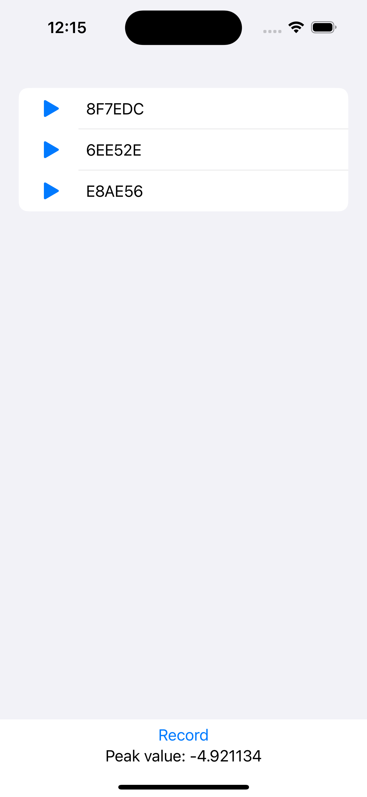

# FDAAudioPlayerRecorder
FDAAudioPlayerRecorder is Swift 5.9 library for iOS 13.0+ that allows you to play and record audio files. It is based on AVFoundation framework.

## Installation
Add this dependency to your project:
```
https://github.com/Sfresneda/FDAAudioPlayerRecorder
```

## Usage
Here is an example of how to use this library:

```swift
import FDAAudioPlayerRecorder

final class Foo {
    
    var audioPlayerRecorder: FDAAudioPlayerRecorder = FDAAudioPlayerRecorder()
    
    func play(url: URL) throws {
        try audioPlayerRecorder.startPlaying(url: file.url)
    }

    func pause() async throws {
        try await audioPlayerRecorder.stopPlaying()
    }
    
    func record() throws {
        try audioManager.startRecording()
    }
    
    func stop() async throws {
        try await audioManager.stopRecording()
    }
}
````

Check [example project](https://github.com/Sfresneda/FDAAudioPlayerRecorder/tree/main/Example) for more details.



## License
This project is licensed under the Apache License 2.0 - see the [LICENSE](LICENSE) file for details

## Author
Sergio Fresneda - [sfresneda](https://github.com/Sfresneda)

